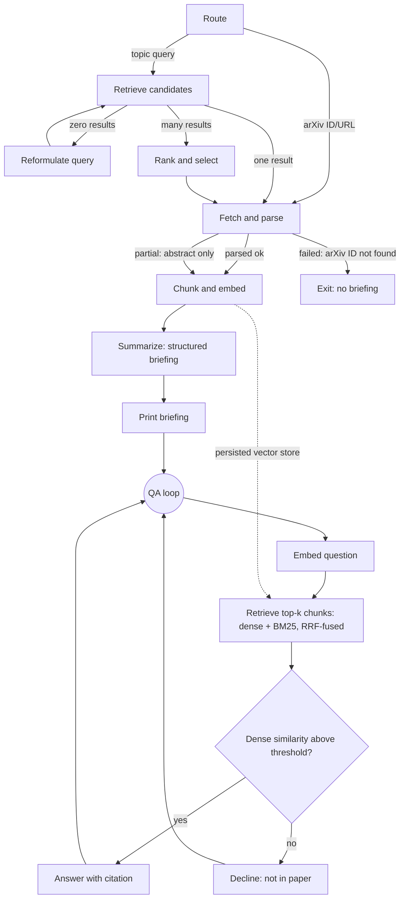

# Autonomous arXiv Paper Digest & QA Agent

An agentic pipeline that searches arXiv, fetches PDFs, performs section-aware parsing and hybrid chunking, generates a structured executive briefing, and exposes a grounded QA loop.

Built for the 8byte intern assessment.

## Architecture

This system uses an explicit state machine (a custom graph executor, not LangGraph) to route and process papers.



- **Route:** Deterministic regex check (no LLM) to separate topic searches from direct IDs.
- **Retrieve/Rank:** Fetches candidates via the `arxiv` package. Ranks by semantic similarity to the query (using local dense embeddings) with recency as a tiebreaker.
- **Fetch & Parse:** Downloads the PDF and uses PyMuPDF font-size heuristics to extract section headings. Falls back gracefully to abstract-only if the layout is broken.
- **Chunk & Embed:** Section-aware chunking (chunks never cross section boundaries). Embeds locally with `sentence-transformers` and indexes into a persistent Chroma store.
- **Summarize:** Uses targeted retrieval to build context field-by-field, then generates a structured JSON briefing.
- **QA Loop:** A hybrid retrieval (Dense + BM25, RRF fused) loop. Each user question is augmented with the paper title before retrieval (`"{paper_title} {question}"`) so that generic questions like "what problem does this paper solve?" still retrieve relevant chunks despite having no domain vocabulary. Answers are gated by the max dense similarity of retrieved chunks to prevent hallucination.

## Setup and run

Python 3.11+ is recommended. 

1. **Clone and setup venv**
   ```bash
   # Windows
   python -m venv .venv
   .venv\Scripts\activate

   # Mac/Linux
   python3 -m venv .venv
   source .venv/bin/activate
   ```

2. **Install dependencies**
   ```bash
   pip install -r requirements.txt
   ```
   *(Note: This downloads `sentence-transformers` which is a few hundred MBs).*

3. **Configure API Keys**
   Copy `.env.example` to `.env` and add your Groq API key.
   ```bash
   cp .env.example .env
   # Edit .env and set GROQ_API_KEY=your_key
   ```

4. **Run the agent**
   ```bash
   python main.py
   ```
   Or pass a query directly:
   ```bash
   python main.py "recent work on KV-cache compression"
   python main.py 1706.03762
   ```

## Example Run

*Input: `python main.py 1706.03762`*

```text
  Detected arXiv ID: 1706.03762
  Fetching paper by ID: 1706.03762
  Paper: Attention Is All You Need
  PDF:   http://arxiv.org/pdf/1706.03762v7
  Parse status: ok (15 sections)
  Sections: abstract, introduction, background, model architecture, ...
  Created 54 chunks from 15 sections
  Indexed in collection: arxiv_1706_03762
  Running targeted retrieval for each briefing field...
  Generating structured briefing...
  ✓ Briefing generated successfully

════════════════════════════════════════════════════════════
  📋 STRUCTURED BRIEFING
════════════════════════════════════════════════════════════

  Title:     Attention Is All You Need
  Authors:   Ashish Vaswani, Noam Shazeer, Niki Parmar, ...
  arXiv ID:  1706.03762
  Published: 2017-06-12
  Link:      https://arxiv.org/abs/1706.03762
  Source:    full_text

  Summary:
    This paper introduces the Transformer, a novel network architecture based
    entirely on attention mechanisms, discarding recurrence and convolutions
    entirely. The Transformer achieves state-of-the-art results on English-to-
    German and English-to-French translation tasks, while requiring significantly
    less training time than previous models.

  Problem Statement:
    Previous dominant sequence transduction models relied on complex recurrent or
    convolutional neural networks, which are computationally expensive and
    difficult to parallelize.

  Method:
    • Employs an encoder-decoder structure.
    • Uses multi-head self-attention mechanisms in both the encoder and decoder.
    • Replaces recurrent layers with point-wise, fully connected layers.
    • Utilizes positional encoding to inject sequence order information.

  Key Results:
    • 28.4 BLEU on WMT 2014 English-to-German (+2 BLEU over previous SOTA).
    • 41.8 BLEU on WMT 2014 English-to-French (new SOTA).
    • Significantly reduced training costs.

  Limitations:
    • Not explicitly discussed: Performance on tasks requiring long-term
      dependencies beyond the context window.

  Follow-up Questions:
    ? How does the Transformer perform on speech recognition or summarization?
    ? Can the Transformer be adapted for structured data or graphs?

════════════════════════════════════════════════════════════
  📝 QA Mode — ask questions about the paper
  Type 'quit' or 'exit' to stop
════════════════════════════════════════════════════════════

  Your question: what was the english to french bleu score?

  Answer: The English-to-French BLEU score was 41.8.
  Sources: results:results_1, results:results_0

  Your question: did they test it on images?

  ⚠ Low confidence (similarity=0.103)
  I could not find information in the paper that is relevant enough to answer
  this question confidently.
```

## Design Decisions & Tradeoffs

### What I chose

- **Custom State Machine over LangGraph:** This agent implements an explicit state machine with a tiny custom graph executor. This avoids masking logic behind a heavy framework API and proves an understanding of the actual primitives (state injection, conditional routing, branching).
- **Local Embeddings over Hosted APIs:** I used `sentence-transformers` locally. Chunking a paper produces tens to hundreds of chunks. Embedding them via an API burns through free-tier limits fast and adds latency; local embeddings are free, private, and run fine on a CPU.
- **Section-Aware Chunking + Metadata:** Chunks are sliced strictly within PyMuPDF-detected section boundaries. Every chunk is tagged with its section heading. This makes the `Sources` output in the QA loop independently verifiable (you can check the section name and chunk ID), which is better than hallucinating citations.
- **Hybrid Retrieval (Dense + BM25) with RRF:** I added BM25 to catch exact-term and numeric queries (e.g. "what was the batch size") that dense embeddings frequently miss. They are fused using Reciprocal Rank Fusion (RRF). 
- **Confidence Gating on Max Dense Similarity:** The QA loop refuses to answer if retrieved chunks don't cross a confidence threshold. Crucially, this threshold evaluates the *maximum raw dense similarity* of the top retrieved chunks, not the RRF fusion score, as RRF scores are uncalibrated and drop too steeply.
- **Title-Augmented QA Retrieval:** User questions are prepended with the paper title before being sent to the vector store. This anchors generic questions ("what problem does this paper solve?") in domain-specific vocabulary, dramatically improving retrieval quality without changing the question sent to the LLM for answer generation.

### What I'd do differently with more time

- **Cross-Encoder Reranking:** Instead of just BM25 + dense fusion, I would pass the top 20 fused candidates through a local cross-encoder (like `ms-marco-MiniLM-L-6-v2`) for much sharper context selection before passing it to the LLM.
- **Claim Verification:** I would add a second, very cheap LLM call in the QA loop that explicitly verifies if the generated answer logically follows from the cited chunks, acting as a final anti-hallucination guardrail.
- **OCR Fallback:** Currently, if PyMuPDF fails to read text (e.g., scanned images), the parser degrades to abstract-only. With more time, I would integrate `unstructured.io` or `pytesseract` for a fallback OCR pass.

### Known Limitations

- **Heuristic Section Detection:** Section headings are detected using a median + 2pt font-size heuristic. This works for most arXiv PDFs but will misfire on highly non-standard layouts, dropping the paper to "partial" parse status (abstract only).
- **Hardcoded Confidence Threshold:** The dense similarity threshold (0.35) for QA grounding was manually tuned, not statistically calibrated against a labeled dataset.
- **Single-User Architecture:** Chroma persistent client and global state make this a local, single-user tool. It would require a refactor to a proper session DB (like Postgres/pgvector) to support concurrent web users.

## Rate Limits

This project defaults to the `openai/gpt-oss-20b` model via the Groq API. 
- You may hit rate limits if you ask many QA questions in rapid succession. 
- The `tenacity` library is implemented on the `llm_client` to automatically catch 429 errors and apply exponential backoff.
